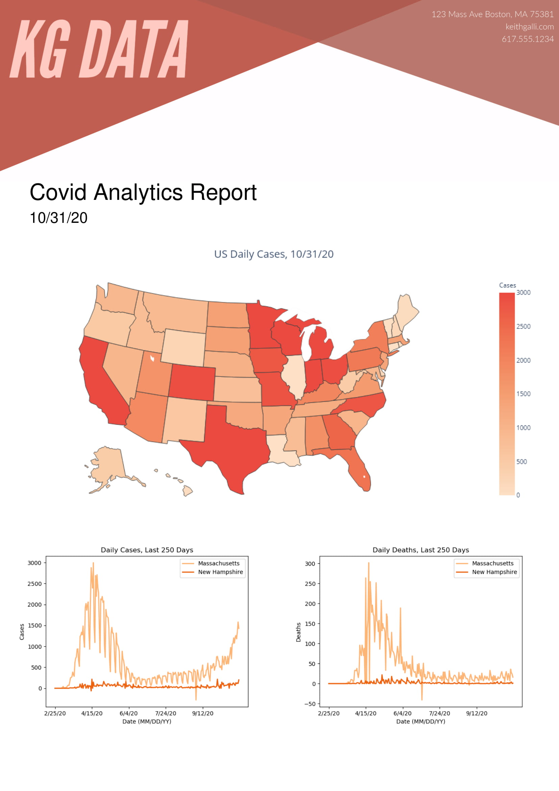

# Generate Analytics Report

This repo goes along with my YouTube video "Generating an Analytics Report (PDF) in Python". In it we learn how to use the fpdf library to create a report like the one you see above.
<br/>
<br/>
Link to video: https://youtu.be/UmN2_R4KEg8

## Setup
You'll want to download all of this code locally. The easiest way to do that is cloning the repo.
```
$ git clone https://github.com/KeithGalli/generate-analytics-report.git
```
If you have any trouble doing this, you can download the zip folder of this repo and then extract the files to a local file. Once you have all the files cloned locally, you should make sure you have all the necessary libraries installed.
```
$ pip install fpdf
$ pip install pandas numpy matplotlib
$ pip install plotly
$ pip install -U kaleido
```
If you run into an error with NumPy, changing the version to 1.19.3 fixed the issue for me
```
$ pip install numpy==1.19.3
```
To test if everything is set up properly, try running `python generate_report.py`. You should get a fresh report file. You'll have to change `helper.py` to read from the online version of the data if you want to access the previous day (uncomment the BASE_PATH URL and comment BASE_PATH='./data'). You will also have to comment out the hard coded date at the bottom of `generate_report.py` file. I saved it this way so not too many unneccesary requests to the GitHub server were made while testing.
